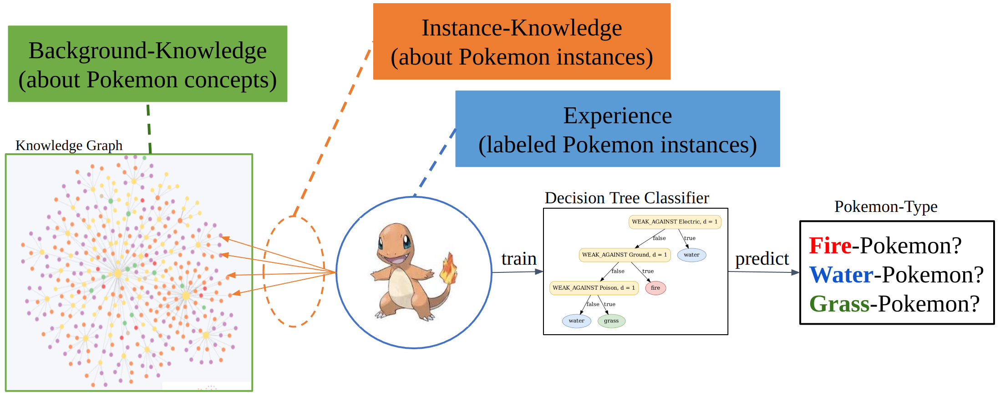

# Optimizing-MINDWALC-Node-Classification-to-Extract-Interpretable-Decision-Trees-from-KGs

[](./title-img.png) 

This python project was created as part of the article: \
"_Investigating and Optimizing MINDWALC Node Classification to Extract Interpretable Decision Trees from Knowledge Graphs_".
Which is a follow-up to the original MINDWALC paper of : \
"[MINDWALC: mining interpretable, discriminative walks for classification of nodes in a knowledge graph](https://bmcmedinformdecismak.biomedcentral.com/articles/10.1186/s12911-020-01134-w)"

The paper can be found [here](https://) (link commming soon, paper is in reviewing process). \
We are in contact with with the MINDWALC inventors and our proposed MINDWALC optimizations will 
soon also be available in the original [MINDWALC repo](https://github.com/predict-idlab/MINDWALC). 

## Requirements and Installation

**OS-WARNING:** 
Currently, MINDWALC works best on Linux or MacIS. 
Windows does also work, however, since MINDWALC uses [ray](https://docs.ray.io/en/latest/ray-overview/installation.html), 
which is currently not fully supported on Windows (only experimental), you may encounter some issues on this OS. 

### 1) Install graphviz

Graphviz is used to visualize trained decision trees and export them as pdf files. 
If you need this feature, please install the graphviz kernel on your os:

- Ubuntu/Debian: `sudo apt-get install graphviz`
- MacOS: `brew install graphviz`
- windows: https://graphviz.org/download/

### 2) Install required python packages

Install the required python packages in your python environment with pip:
```
pip install -r requirements.txt
```

### 3) (optional) Install Neo4j Desktop

Many of our scripts process graphs stored as Neo4j databases (e.g. `node_classification/RRR_node_classification.py`). \ 
To make these scripts work, you need to download and install Neo4j Desktop on your OS of choice ([https://neo4j.com/download/](https://neo4j.com/download/)).

## How to get the graph-datasets, used in our paper:

### AIFB Graph
See [MINDWALC/mindwalc/data/AIFB](MINDWALC/mindwalc/data/AIFB).

### BGS Graph
Can be obtained at https://data.dws.informatik.uni-mannheim.de/rmlod/LOD_ML_Datasets/. 

### MUTAG Graph
Can be obtained at https://data.dws.informatik.uni-mannheim.de/rmlod/LOD_ML_Datasets/. 

### ProstateToyGraph

This graph is based on the Snomed CT ontology. Therefore, we cannot provide the graph directly.
However, if you have access to Snomed CT, you can generate the graph yourself.

This are the necessary steps:
1. Generate a locally running Snomed CT Neo4j graph database. For this, please follow the guide provided at [./graph_processing/snomed_graph_installation/README.md](./graph_processing/snomed_graph_installation/README.md).
2. Next, run the script [./graph_processing/ProstateToyGraph/extend_graph.py](./graph_processing/ProstateToyGraph/extend_graph.py) to extend the graph with the prostate cancer related nodes and edges. It will also mark some nodes with label `ProstateCenterNode`. \
Attention: The execution-terminal will ask you several question about how to handle certain conflicts. To create the exact same dataset as in our paper, always type '`n`' for '`Is it similar?`' questions and '`y`' for '`Do you want to add A) to the graph ...`' questions.
3. Next. run the script [./graph_processing/centernode_based_subgraph_generation.py](./graph_processing/centernode_based_subgraph_generation.py) to extract a smaller part of the whole snomed graph that is centered around the prostate cancer related nodes of type `ProstateCenterNode`. \
This way smaller graph will be easier to handle, explore and process. \
The execution-terminal will sometimes stop to give you some instructions (copy paste some files, launch new neo4j db) and wait for your input.
4. Finally, run the script [./graph_processing/ProstateToyGraph/add_instances_to_graph.py](./graph_processing/ProstateToyGraph/add_instances_to_graph.py) to randomly add synthetic labeled case-instance-nodes to the graph.

### GottaGraphEmAll Pokemon Graph
Unfortunately, we cannot provide this Pokemon graph publicly, due to unclarified licensing issues. 
The dataset has originally been created by Mr. Joe Depeau, Senior Pre-Sales Consultant of Neo4j, who once presented it in this [Neo4j Blog post](https://neo4j.com/blog/pokegraph-gotta-graph-em-all/). \
He kindly provided us with the dataset for our research, but it is still not clear if we are allowed to share it.

### TreeOfLife Pokemon Graph
See  `./data/TreeOfLife/TreeOfLife.1.1.dump` **TODO: Export the dump file!!!**

### Combined Pokemon graph
Since this database is based on the GottaGraphEmAll Pokemon Graph, we cannot provide it publicly.

## Usage and Reproducing paper results

### 1) Benchmark-tests on AIFB, BGS and MUTAG datasets:

This is quite uncomplicated and therefore is recommended to start with. \
To run our experiments (in paper: Chapter 3.4), you need to use [node_classification/benchmark_knowledge_graphs.py](node_classification/benchmark_knowledge_graphs.py).
First, uncommend the desired dataset in the script and then run it. \
Although MINDWALC is quite fast, the script may take some time to finish, since it does some grid-search for hyperparameter optimization on each (of 10) runs.

To validate a test-run, use the script 
[node_classification/validade_benchmark_KG_results.py](node_classification/validade_benchmark_KG_results.py) 
to parse the results and plot f1 and accuracy tables. 

### 2) Tests with Random Relation Removement (RRR) on toy datasets:

To run our experiments (in paper: Chapter 3.1, 3.2 and 3.3), you need to use [node_classification/RRR_node_classification.py](node_classification/RRR_node_classification.py). 

Before starting this script, you first need to start the corresponding Neo4j graph, which you want to process. 
(e.g. firtst start the neo4j db of the neo4j-dataset `./data/TreeOfLife/TreeOfLife.1.1.dump` to run tests on this db).

Then, configure (edit global variables in script) 
and run the script [node_classification/RRR_node_classification.py](node_classification/RRR_node_classification.py)
which stepwise destroys the "Instance Knowledge" by randomly removing the relations between instance-nodes and its neighbors.
(Process is called "_instance knowledge degradation_", aka _RRR - Random Relation Removement_). \
On Each destruction-step, the script will run the MINDWALC node classification algorithm (according to your configuration) 
on the graph and store the results in a structured way (see console output for details).

Then, to plot the same instance-knowledge degradation curves as shown in the paper, 
configure and run the script 
[node_classification/RRR_node_clfs_plot.py](node_classification/RRR_node_clfs_plot.py) accordingly.

## Acknowledgements

We would like to thank the inventors of [MINDWALC](https://github.com/predict-idlab/MINDWALC), without whom this work would not exist. 
This includes in particular Dr. Gilles Vandewiele et al. 
who developed MINDWALC while working at the research group IDLab, Ghent University - imec.

## citation

... coming soon...


