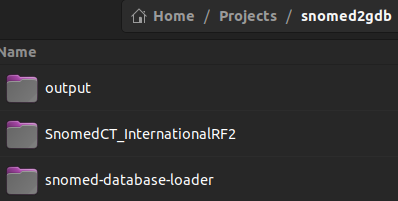
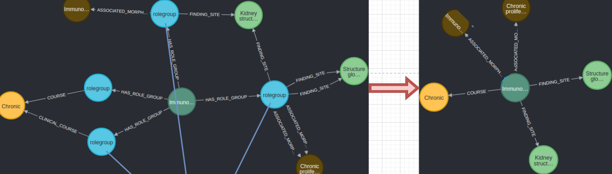

# Create Neo4j Snomed Database

## Snomed Ontology to Neo4J Graph Database 

How to convert Snomed CT into a **G**raph **D**ata**b**ase (GDB) using Neo4J:.

### Requirements:

- At least **Java 8**
- at least **Python 3.5** with:
- **py2neo python Library**.
- Should work on Windows, Mac or Linux Systems

### 1) Setup empty Neo4 GDB

Open up Neo4j Desktop, create a project with Settings:

#### Settings:

```
# ...

## Java Heap Size
dbms.memory.heap.initial_size=4G
dbms.memory.heap.max_size=4G
## Together these allow import from anywhere on the system
#dbms.directories.import=import
dbms.security.allow_csv_import_from_file_urls=true

# ...
```

Start up the Database!

### 2) Prepare data and folder structure

Next, set up a folder (named "snomed2gdb", in this case) which contains these 3 folders:

[](./folder structure.png)

- the Snomed CT Release files (<span data-comment-id="5bc2b009-7bfc-475a-aa63-8ba2f45a6274" data-type="comment">[login](https://mlds.ihtsdotools.org/#/login), then got to [release packages](https://mlds.ihtsdotools.org/#/viewReleases)</span>),
- the [snomed-database-loader](https://github.com/IHTSDO/snomed-database-loader) github repository,
- and an empty file, named "output". The output file must be **empty** on execution, so if there are issues with loading and a restart is necessary, make sure to empty this file before restart.

### 3) Execute snomed-database-loader

Use an environment which has py2neo installed. Example:

```
conda create –name neo4j_env1
conda activate neo4j_env1
pip install py2neo
```

Its time to start up the prepared Neo4j Database, hit the start button in Neo4j.

Now execute the snomed-database-loader:

```
cd /path/to/snomed-database-loader/NEO4J
python snomed_g_graphdb_build_tools.py db_build --release_type full --mode build --action create --rf2 /path/to/snomed2neo4j_gdb/SnomedCT_InternationalRF2/Full/ --neopw YOURPASSW --output_dir /path/to/snomed2neo4j_gdb/output/
```

Once the code is running it will take some time to import the entire ontology into Neo4j, but the following output should indicate a correct install:

```
sequence did not exist, primed
JOB_START
FIND_ROLENAMES
FIND_ROLEGROUPS
MAKE_CONCEPT_CSVS
MAKE_DESCRIPTION_CSVS
MAKE_ISA_REL_CSVS
MAKE_DEFINING_REL_CSVS
TEMPLATE_PROCESSING
CYPHER_EXECUTION
CHECK_RESULT
JOB_END
RESULT: SUCCESS
```

### 4) Further Improvements

Afterwards you can polish up the neo4j GDB by dividing the "ObjectConcept"-labeled nodes into further sub-labels (morphology, description, disease ...):

<span style="text-decoration: underline;">TODO: put all these custom improvements into our pythological-nlp library!!!</span>

```sql
MATCH (n:ObjectConcept) WHERE n.FSN ENDS WITH '(substance)'
SET n:Substance
RETURN n LIMIT 10

MATCH (n:ObjectConcept) WHERE n.FSN ENDS WITH '(finding)'
SET n:Finding
RETURN n LIMIT 10

MATCH (n:ObjectConcept) WHERE n.FSN ENDS WITH '(body structure)'
SET n:BodyStructure
RETURN n LIMIT 10

MATCH (n:ObjectConcept) WHERE n.FSN ENDS WITH '(observable entity)'
SET n:ObservableEntity
RETURN n LIMIT 10

MATCH (n:ObjectConcept) WHERE n.FSN ENDS WITH '(organism)'
SET n:Organism
RETURN n LIMIT 10

MATCH (n:ObjectConcept) WHERE n.FSN ENDS WITH '(product)'
SET n:Product
RETURN n LIMIT 10

MATCH (n:ObjectConcept) WHERE n.FSN ENDS WITH '(procedure)'
SET n:Procedure
RETURN n LIMIT 10

MATCH (n:ObjectConcept) WHERE n.FSN ENDS WITH '(disorder)'
SET n:Disorder
RETURN n LIMIT 10

MATCH (n:ObjectConcept) WHERE n.FSN ENDS WITH '(morphologic abnormality)'
SET n:MorphologicAbnormality
RETURN n LIMIT 10

MATCH (n:ObjectConcept) WHERE n.FSN ENDS WITH '(situation)'
SET n:Situation
RETURN n LIMIT 10

MATCH (n:ObjectConcept) WHERE n.FSN ENDS WITH '(qualifier value)'
SET n:QualifierValue
RETURN n LIMIT 10

MATCH (n:ObjectConcept) WHERE n.FSN ENDS WITH '(occupation)'
SET n:Occupation
RETURN n LIMIT 10

MATCH (n:ObjectConcept) WHERE n.FSN ENDS WITH '(environment)'
SET n:Environment
RETURN n LIMIT 10

MATCH (n:ObjectConcept) WHERE n.FSN ENDS WITH '(physical object)'
SET n:PhysicalObject
RETURN n LIMIT 10

MATCH (n:ObjectConcept) WHERE n.FSN ENDS WITH '(physical force)'
SET n:PhysicalForce
RETURN n LIMIT 10

MATCH (n:ObjectConcept) WHERE n.FSN ENDS WITH '(medicinal product)'
SET n:MedicinalProduct
RETURN n LIMIT 10

MATCH (n:ObjectConcept) WHERE n.FSN ENDS WITH '(person)'
SET n:Person
RETURN n LIMIT 10

MATCH (n:ObjectConcept) WHERE n.FSN ENDS WITH '(ethnic group)'
SET n:EthnicGroup
RETURN n LIMIT 10

MATCH (n:ObjectConcept) WHERE n.FSN ENDS WITH '(cell structure)'
SET n:CellStructure
RETURN n LIMIT 10

MATCH (n:ObjectConcept) WHERE n.FSN ENDS WITH '(event)'
SET n:Event
RETURN n LIMIT 10

MATCH (n:ObjectConcept) WHERE n.FSN ENDS WITH '(cell)'
SET n:Cell
RETURN n LIMIT 10

MATCH (n:ObjectConcept) WHERE n.FSN ENDS WITH '(regime/therapy)'
SET n:RegimeorTherapy
RETURN n LIMIT 10

MATCH (n:ObjectConcept) WHERE n.FSN ENDS WITH '(special concept)'
SET n:SpecialConcept
RETURN n LIMIT 10

MATCH (n:ObjectConcept) WHERE n.FSN ENDS WITH '(social concept)'
SET n:SocialConcept
RETURN n LIMIT 10

MATCH (n:ObjectConcept) WHERE n.FSN ENDS WITH '(specimen)'
SET n:Specimen
RETURN n LIMIT 10

MATCH (n:ObjectConcept) WHERE n.FSN ENDS WITH '(record artifact)'
SET n:RecordArtifact
RETURN n LIMIT 10

MATCH (n:ObjectConcept) WHERE n.FSN ENDS WITH '(tumor staging)'
SET n:TumorStaging
RETURN n LIMIT 10

MATCH (n:ObjectConcept) WHERE n.FSN ENDS WITH '(navigational concept)'
SET n:NavigationalConcept
RETURN n LIMIT 10

MATCH (n:ObjectConcept) WHERE n.FSN ENDS WITH '(attribute)'
SET n:Attribute
RETURN n LIMIT 10
```

And we can extend the Terminology to add missing Features: As example i missed the Synonym "NET" for "Neuroendocrine tumor" and some other synonyms:

```sql
MATCH (a) 
WHERE (a:Disorder OR a:MorphologicAbnormality) AND a.FSN = 'Neuroendocrine tumor' 
MERGE (a)-[:HAS_DESCRIPTION]->(b:Description {descriptionType: 'Synonym', sctid: a.sctid, term: 'NET'})

MATCH (a) 
WHERE (a:Disorder OR a:MorphologicAbnormality) AND a.FSN = 'Immunoglobulin A nephropathy' 
MERGE (a)-[:HAS_DESCRIPTION]->(b:Description {descriptionType: 'Synonym', sctid: a.sctid, term: 'IgAN'})

MATCH (a) 
WHERE (a:BodyStructure) AND a.FSN = 'Glomerular capsule structure' 
MERGE (a)-[:HAS_DESCRIPTION]->(b:Description {descriptionType: 'Synonym', sctid: a.sctid, term: 'Bowman capsule'})

MATCH (a:ObjectConcept) WHERE a.sctid="29985007"
MERGE (a)-[:HAS_DESCRIPTION]->(b:Description {descriptionType: 'Synonym', sctid: a.sctid, term: 'lambda immunoglobulin light chain'})
```

####   


#### Full-Text-Search

We could do some [full-text- search indexing](https://neo4j.com/docs/cypher-manual/current/indexes-for-full-text-search/), in order to be able to execute fast Text-search queries, using the default analyzer "standard-no-stop-words" (use `CALL db.index.fulltext.listAvailableAnalyzers` to get info about other analyzers):

```sql
CREATE FULLTEXT INDEX descriptionTerms FOR (n:Description) ON EACH [n.term]

CREATE FULLTEXT INDEX obectConceptTerms FOR (n:ObjectConcept) ON EACH [n.FSN]
```

For us, the english analyser workes best so far:

```sql
CREATE FULLTEXT INDEX descriptionTerms FOR (n:Description) ON EACH [n.term]
OPTIONS {
  indexConfig: {
    `fulltext.analyzer`: 'english',
    `fulltext.eventually_consistent`: true
  }
}
```

Now we can do a Fulltext search stuff. Examples:

```sql
// full-text search for  "gastric adenocarcinoma":
CALL db.index.fulltext.queryNodes("descriptionTerms", "gastric adenocarcinoma") YIELD node, score
RETURN node.term, node.sctid, score LIMIT 10

// get node with best score:
CALL db.index.fulltext.queryNodes("descriptionTerms", "gastric adenocarcinoma") YIELD node, score
RETURN node LIMIT 1

// directly get the corresponding ObectConcept-Node of the best hit (Description with best score):
CALL db.index.fulltext.queryNodes("descriptionTerms", "gastric adenocarcinoma") YIELD node as N
match (N)<-[]-(x) return x LIMIT 1

// get some infos about corresponding ObectConceot of the 10 best dosorder-typed concepts:
CALL db.index.fulltext.queryNodes("descriptionTerms", "gastric adenocarcinoma") YIELD node as N, score as S
match (N)<-[]-(x:Disorder) return x.FSN, x.sctid, S LIMIT 10
```

We can utilise the whole power of [apache lucene](https://lucene.apache.org/) by using its syntax as second argument of db.index.fulltext.queryNodes (search term):

```sql
// search only for exact hits ("gastric" needs to be left to "adenocarcinoma"):
CALL db.index.fulltext.queryNodes("descriptionTerms", '"gastric adenocarcinoma"') YIELD node, score
RETURN node.term, node.sctid, score LIMIT 10


// Using an AND operator:
CALL db.index.fulltext.queryNodes("descriptionTerms", 'gastric AND adenocarcinoma') YIELD node, score
RETURN node.term, node.sctid, score LIMIT 10
```

Learn more about text-search with lucene here: [https://lucene.apache.org/core/5\_5\_5/queryparser/org/apache/lucene/queryparser/classic/package-summary.html#Overview](https://lucene.apache.org/core/5_5_5/queryparser/org/apache/lucene/queryparser/classic/package-summary.html#Overview)

For us, this implementation of a fuzzy phrase search workes best so far:

```sql
CALL db.index.fulltext.queryNodes("descriptionTerms", '\\"Light~ chain~ deposit~ disease~\\"') YIELD node, score
RETURN node.term as search_term, node.sctid as sctid, score LIMIT 10
```

other usefull commands:

```sql
SHOW FULLTEXT INDEXES

DROP INDEX descriptionTerms
```

#### Full-Text-Search optimizations

We can also delete the ' (concept type)'-Substrings (might be helpfull for text search queries):

```sql
MATCH (n:Substance) 
SET n.FSN = replace(toString(n.FSN), ' (substance)', '')

MATCH (n:Finding) 
SET n.FSN = replace(toString(n.FSN), ' (finding)', '')

MATCH (n:BodyStructure) 
SET n.FSN = replace(toString(n.FSN), ' (body structure)', '')

MATCH (n:ObservableEntity) 
SET n.FSN = replace(toString(n.FSN), ' (observable entity)', '')

MATCH (n:Organism) 
SET n.FSN = replace(toString(n.FSN), ' (organism)', '')

MATCH (n:Product) 
SET n.FSN = replace(toString(n.FSN), ' (product)', '')

MATCH (n:Procedure) 
SET n.FSN = replace(toString(n.FSN), ' (procedure)', '')

MATCH (n:Disorder) 
SET n.FSN = replace(toString(n.FSN), ' (disorder)', '')

MATCH (n:MorphologicAbnormality) 
SET n.FSN = replace(toString(n.FSN), ' (morphologic abnormality)', '')

MATCH (n:Situation) 
SET n.FSN = replace(toString(n.FSN), ' (situation)', '')

MATCH (n:QualifierValue) 
SET n.FSN = replace(toString(n.FSN), ' (qualifier value)', '')

MATCH (n:Occupation) 
SET n.FSN = replace(toString(n.FSN), ' (occupation)', '')

MATCH (n:Environment) 
SET n.FSN = replace(toString(n.FSN), ' (environment)', '')

MATCH (n:PhysicalObject) 
SET n.FSN = replace(toString(n.FSN), ' (physical object)', '')

MATCH (n:PhysicalForce) 
SET n.FSN = replace(toString(n.FSN), ' (physical force)', '')

MATCH (n:MedicinalProduct) 
SET n.FSN = replace(toString(n.FSN), ' (medicinal product)', '')

MATCH (n:Person) 
SET n.FSN = replace(toString(n.FSN), ' (person)', '')

MATCH (n:EthnicGroup) 
SET n.FSN = replace(toString(n.FSN), ' (ethnic group)', '')

MATCH (n:CellStructure) 
SET n.FSN = replace(toString(n.FSN), ' (cell structure)', '')

MATCH (n:Event) 
SET n.FSN = replace(toString(n.FSN), ' (event)', '')

MATCH (n:Cell) 
SET n.FSN = replace(toString(n.FSN), ' (cell)', '')

MATCH (n:RegimeorTherapy) 
SET n.FSN = replace(toString(n.FSN), ' (regime/therapy)', '')

MATCH (n:SocialConcept) 
SET n.FSN = replace(toString(n.FSN), ' (social concept)', '')

MATCH (n:Specimen) 
SET n.FSN = replace(toString(n.FSN), ' (specimen)', '')

MATCH (n:RecordArtifact) 
SET n.FSN = replace(toString(n.FSN), ' (record artifact)', '')

MATCH (n:TumorStaging) 
SET n.FSN = replace(toString(n.FSN), ' (tumor staging)', '')

MATCH (n:NavigationalConcept) 
SET n.FSN = replace(toString(n.FSN), ' (navigational concept)', '')

MATCH (n:Attribute) 
SET n.FSN = replace(toString(n.FSN), ' (attribute)', '')
```

#### RoleGroup Resolving

Relations between ObjectConcepts are in many cases indirected via a "rolegroup" node. THis makes the whole graph more complicated and the RouleGroup is not that informative for us.

Therefore we resolved these RoleGroup-nodes like this:

[](./rolegroups.png)

with the provided script ```./resolve_rolegroups.py``` (execution takes some time!).

After that, we get a lot of duplicated Relations between our ObjectConcepts. We can delete the duplicated Relations with the following cypher query (takes time, might crash if not enough RAM!): WARNING: Create a dump (backup) of your neo4j db first!

```sql
match (s:ObjectConcept)-[r]->(e:ObjectConcept)
with s,e,type(r) as typ, tail(collect(r)) as coll 
foreach(x in coll | delete x)
```

<div id="bkmrk--2"></div>